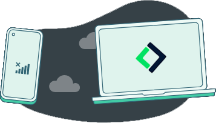
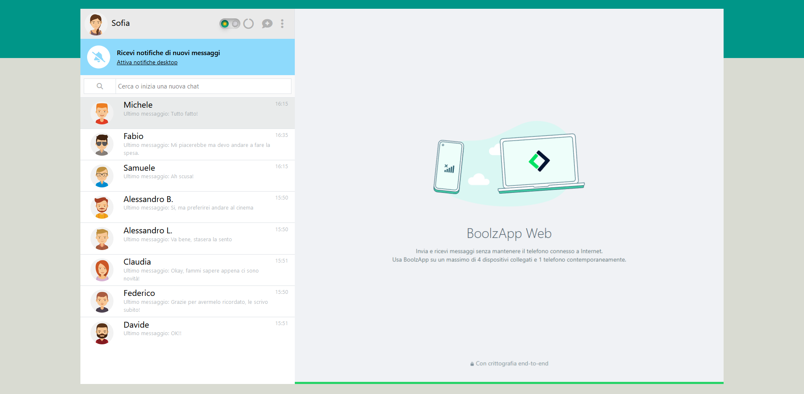

  
  <h3 align="center">BoolzApp Web</h3>

  
Table of Contents

  <ol>
    <li>
      <a href="#about-the-project">About The Project</a>
      <ul>
        <li><a href="#built-with">Built With</a></li>
      </ul>
    </li>
    <li>
      <a href="#getting-started">Getting Started</a>
      <ul>
        <li><a href="#prerequisites">Prerequisites</a></li>
        <li><a href="#usage">Usage</a></li>
      </ul>
    </li>
    <li><a href="#roadmap">Roadmap</a></li>
    <li><a href="#contact">Contact</a></li>
  </ol>

## About The Project

BoolzApp Web App, an amazing imitation of a webapp of a instant messaging service, where you'll be able to text with your friends, see their msg, swap chats, get reply and many more!

(<a href="#readme-top">back to top</a>)

### Built With:

* 
* 
* 

(<a href="#readme-top">back to top</a>)

## Getting Started

### Prerequisites

Working browser like chrome,firefox,safari with a 1080p display at least for proper visualization, not ment to be seen on mobile
 

### Usage

To view the project and experience it, download the repository, unzip it and open the index.html

As soon as you open it, you'll get a prompt asking you for a Key of Openai.

This will allow you to use the site with the Gpt3.5-Turbo AI replying to your msg feature, but in case you don't have one you still can use the site, just press 'OK' and the site will load

In case you want to get a Key the procedure to get it the following:
      1. Go to: https://platform.openai.com/docs/quickstart/build-your-application
      2. Create an account or login
      3. Click on "+ Create new secret key"
      4. Copy it and paste it on the prompt that open everytime you refresh the index.html in your browser

You're ready to enjoy the BoolzApp Web!

(<a href="#readme-top">back to top</a>)

## Roadmap

- [x] Add response to the sent message made with Gpt3.5-turbo
- [x] Add improved request to AI so it reply as the person you're sending the message to would
- [x] Add if an empty message or just spaces get sended it will not be sent
- [x] Add if there is text in the send message bar, a paper plane will show up close to the bar and can be clicked to ssend the msg
- [x] Add reply of the message sent in case the Key to access to openai service will not work are randomized
- [x] Add blank page before any chat get selected
- [x] Add loading screen that last 1s with animation
- [x] Add scroll down after one message get sent
- [x] Add darkmode button and function
- [x] Add possibility to create a new chat
- [x] Add button to delete all the messages from one chat
- [x] Add button to delete an entire contact with relative chat/messages
- [x] Add emoji list when smiley face get clicked

(<a href="#readme-top">back to top</a>)

## 📧 Contact me:

 
Project Link: [Boolzapp Web](https://github.com/GabrieleMajocchi/vue-boolzapp/tree/main/bonus)

(<a href="#readme-top">back to top</a>)

